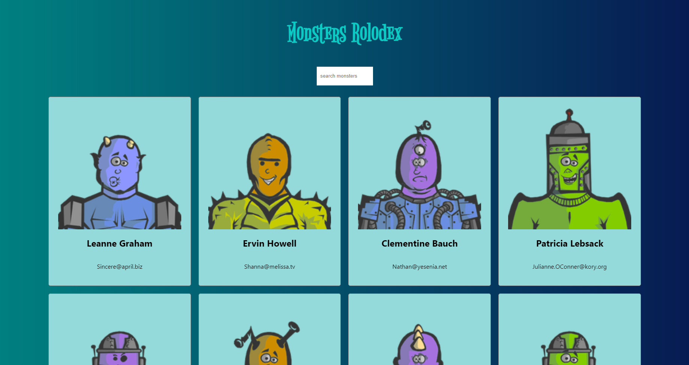
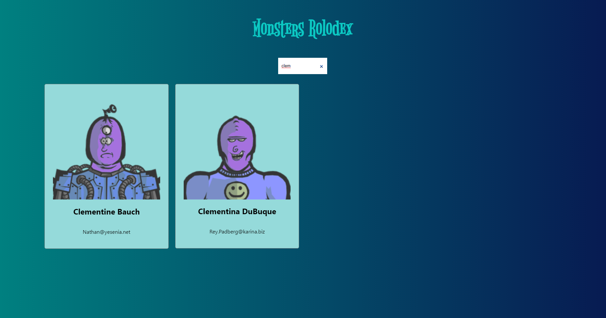

<h1 align="center"> Monsters Rolodex </h1>

 Monsters Rolodex is web project developed during the Complete React Developer in 2021 (w/ Redux, Hooks, GraphQL) course, to search among a group of monsters 

  
<h2> 💻 Languages and tecnologies used </h2>

      <a href="https://reactjs.org/" target="_blank">  

  
<h2> Install </h2>

    - Clonar repositorio
    $ git clone https://github.com/Felipe1496/monsters-rolodex.git && cd monsters-rolodex

    - Instalar dependencias
    $ npm install

    - Rodar aplicativo
    $ npm start
    
<h2> 🥳 Authors </h2>

+ [@Felipe1496](https://github.com/Felipe1496)

<h2> 📸 Screenshots </h2>

